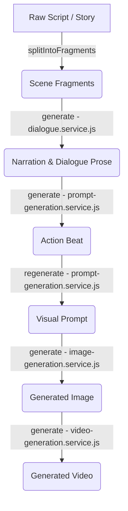

# 🎬 Storyboard Image POC

An online tool that translates raw stories into playable storyboards and produces single videos with synchronized images, video, text, and synthetic voices. Paste in a story, choose an art style, and generate a sequence of scenes complete with visual prompts, AI-rendered images, matching narration, and based on your reference art.

---

## Quick Start

1. **Configure Environment**:
   ```bash
   cp apps/web/.env.example apps/web/.env
   # Add your GEMINI_API_KEY
   ```
2. **Install Dependencies**:
   ```bash
   npm --prefix apps/web install
   ```
3. **Database Setup**:
   ```bash
   docker compose up -d postgres
   npm --prefix apps/web run prisma:migrate:deploy
   ```
4. **Natural TTS Engine (Optional)**:
   ```bash
   npm run setup:piper
   ```
5. **Start Application**:
   ```bash
   npm run dev:web
   ```
6. **Open in Browser**: Navigate to `http://localhost:3000`

---

## Repo Layout & Architecture

This is a monorepo containing independently run applications:

- **[apps/web/](apps/web/)**: Node.js/Express storyboard platform (deploys to Railway).
- **[apps/voice-service/](apps/voice-service/)**: Python/FastAPI + Spark-TTS voice cloning (deploys to Modal).
- **[apps/piper-service/](apps/piper-service/)**: Python/FastAPI + Piper neural TTS free tier (deploys to Modal).
- **[apps/alignment-service/](apps/alignment-service/)**: Python/FastAPI WhisperX alignment (local only for now).

### Code Organization & Composition
All business logic is modular and covered by unit tests under `apps/web/test/`:
- `server.js` only loads configuration, initializes dependencies, and starts the Express listener.
- `src/app.js` registers middleware and routes.
- Controllers translate incoming HTTP requests.
- Services manage the generation and persistence workflows (with dependencies injected via `src/dependencies.js`).
- Providers interface with external APIs (Gemini, OpenAI, ElevenLabs, etc.).

---

## Features

- **Text & Image Providers**: Powered by `gemini-3.5-flash` and `gemini-3.1-flash-image` (default), with optional fallbacks for OpenAI, Dezgo, and local stubs.
- **Visual References**: Mapped per-style (characters and environments); supports uploading, previewing, and deleting references in the UI.
- **Scene Management**: Reorder scenes, edit/regenerate visual prompts, switch between historical generated image versions, and download assets as a ZIP.
- **Audio & Video Playback**: One synchronized player with audio/video seeking, auto-looping, and silence padding.
- **Asynchronous Execution**: In-process cancellable generation queue (`GET /api/jobs` and `DELETE /api/jobs/:jobId`).
- **Autosave & Persistence**: Storyboards cache in client `localStorage` and sync to server-side JSON files using monotonic revision locks (`409 REVISION_CONFLICT`).

---

## Included Styles

Styles are loaded dynamically from markdown files under `apps/web/styles/`:
- **Basic Cartoon**
- **Cinematic Reality**
- **Dark Gothic**
- **Indie Youtuber**
- **Vox Style**

---

## AI Generation Pipeline & Prompt Strategy

The storyboard generation follows a structured multi-stage flow:



### Generation Types

| Type | Function | Inputs | Key Constants / Rules |
| :--- | :--- | :--- | :--- |
| **Dialogue/Narration** | Screenplay-to-spoken adaptation | Fragment + Action beat | [dialogue.service.js](file:///Ubuntu/home/administrator/web/basic-cartoon-poc/apps/web/src/services/dialogue.service.js): `NARRATION_RULES_ENRICHED`, `NARRATION_RULES_LITERAL` |
| **Action Beats** | Summary of physical action (5–24 words) | Scene fragment | [prompt-generation.service.js](file:///Ubuntu/home/administrator/web/basic-cartoon-poc/apps/web/src/services/prompt-generation.service.js): `BEAT_RULES` (Caveman-simple present tense verbs) |
| **Visual Prompts** | Camera-agnostic layout prompt (15–40 words) | Beat + Neighbors | [prompt-generation.service.js](file:///Ubuntu/home/administrator/web/basic-cartoon-poc/apps/web/src/services/prompt-generation.service.js): `CONTINUITY_RULE` + Neighboring scene context |
| **Image Generation** | Renders keyframe images | Visual prompt + Style + References | [image-generation.service.js](file:///Ubuntu/home/administrator/web/basic-cartoon-poc/apps/web/src/services/image-generation.service.js): Injects up to 14 character/world reference paths |
| **Video Generation** | Animates static images | Image + Motion instructions | [video-generation.service.js](file:///Ubuntu/home/administrator/web/basic-cartoon-poc/apps/web/src/services/video-generation.service.js): `INTENSITY_MOTION_PROMPTS`, `STYLE_MOTION_PROMPTS` |
| **Voice / Audio** | Synthesizes voiceovers from text | Narration text | [voice.service.js](file:///Ubuntu/home/administrator/web/basic-cartoon-poc/apps/web/src/services/voice.service.js): Piper (local), ElevenLabs (cloud), Spark-TTS (clone) |

### Developer Tuning Guide

#### 1. Invalidate Cache After Updates
The application caches prompt generation outputs. If you modify any service templates or prompt rules, you **must** increment these version flags:
- In [prompt-generation.service.js](file:///Ubuntu/home/administrator/web/basic-cartoon-poc/apps/web/src/services/prompt-generation.service.js): Increment `PROMPT_TEMPLATE_VERSION` and `ACTION_TEMPLATE_VERSION`.
- In [dialogue.service.js](file:///Ubuntu/home/administrator/web/basic-cartoon-poc/apps/web/src/services/dialogue.service.js): Increment `NARRATION_TEMPLATE_VERSION`.

#### 2. Creating & Editing Styles
Create style templates under `apps/web/styles/<style-id>.md`:
* Line 1 **must** be a header (e.g., `# Dark Gothic`).
* Subsequent lines define the visual styling prompts (e.g., contrast, outlines, silhouettes).

#### 3. Image Reference Configuration
Configure default style reference images by creating directories:
- **Characters**: `apps/web/style-references/<style-id>/characters/`
- **World/Environment**: `apps/web/style-references/<style-id>/world/`
*Supported formats: PNG, JPG, WebP, GIF. Sorted alphabetically (up to 8 per category).*

#### 4. Adjusting Prompt Word Budgets
If you need to fine-tune character limits or prompt lengths, update:
- **Video Prompts**: Update `VIDEO_PROMPT_WORD_BUDGET` in [video-generation.service.js](file:///Ubuntu/home/administrator/web/basic-cartoon-poc/apps/web/src/services/video-generation.service.js).
- **Visual Prompts**: Update `limits.prompt` in the dependency injection configuration (which maps to limits enforced in `prompt-generation.service.js`).

---

## Voice & TTS Engines

### Local TTS (Zero-API-Key)
- **Local Fallback**: Rudimentary offline voice synthesis.
- **Piper TTS**: High-quality natural neural TTS.
  - Local: `npm run setup:piper` (downloads into `apps/web/vendor/piper/`).
  - Production: `apps/piper-service` on Modal; set `PIPER_SERVICE_URL` + `PIPER_SERVICE_TOKEN` on the web app.

### Voice Cloning (Spark-TTS)
A zero-shot, commercial-safe cloning daemon located in `apps/voice-service/`. Requires an NVIDIA GPU (tested on RTX 3060, 12GB VRAM).

1. **Setup**:
   ```bash
   npm run setup:spark  # Installs PyTorch, venv, and downloads 4GB models
   ```
2. **Configuration**: 
   Copy `apps/voice-service/.env.example` to `apps/voice-service/.env`. Ensure `SPARK_SERVICE_TOKEN` matches the token in `apps/web/.env`.
3. **Execution**:
   ```bash
   npm run dev:voice   # Starts FastAPI server on http://localhost:8001
   ```
- Cloned voices are stored under `apps/voice-service/voices/<voiceId>/` and are reusable across storyboards.

---

## Storage Design

Committed project media (images, audio, video, subtitles, exports, references) goes through a **BlobStore** persistence boundary. Generation APIs that need filesystem paths use a separate **AssetMaterializer** — temp/cache only, never the source of truth.

```text
staging / provider temp / LTX_SHARED_DIR     → ephemeral local disk
committed project assets                     → BlobStore (local today, optional R2)
provider needs a file path                   → AssetMaterializer → temp or borrowed local path
```

| Layer | Role | Key modules |
| :--- | :--- | :--- |
| **BlobStore** | `put` / `getStream` / `delete` / `exists` | `src/storage/blob-store.js`, `r2-blob-store.js`, `dual-blob-store.js`, `read-fallback-blob-store.js` |
| **AssetMaterializer** | `materialize(storageKey)` → local path + `release()` | `src/storage/asset-materializer.js` |
| **Metadata** | Prisma `Asset` rows (`storageKey`, `publicPath`, quotas) | `prisma-project.repository.js` |

Public asset URLs stay auth-gated (`/projects/:id/assets/...`). Serving and ZIP export stream via `getStream(storageKey)`, not raw disk paths.

### Backends (`STORAGE_BACKEND`)

| Value | Writes | Reads / `exists` | When to use |
| :--- | :--- | :--- | :--- |
| unset / `local` | Local disk under `apps/web/data/projects/` | Local | Default; no Cloudflare account needed |
| `dual` | Local first, then mirror to R2 (R2 failures are logged, not fatal) | Local only | Safe first step once you have an R2 bucket |
| `r2` | R2 only | R2 first, then legacy local fallback | After `dual` is validated |

`dual` / `r2` **fail startup** unless every `R2_*` variable below is set (no silent fall-back to local on a typo).

### Environment variables

Set these in `apps/web/.env` (see also `apps/web/.env.example`):

```dotenv
# local (default) | dual | r2
STORAGE_BACKEND=local

# Required when STORAGE_BACKEND is dual or r2:
R2_ACCOUNT_ID=
R2_ACCESS_KEY_ID=
R2_SECRET_ACCESS_KEY=
R2_BUCKET=
R2_ENDPOINT=https://<accountid>.r2.cloudflarestorage.com

# Unrelated quotas (still apply):
PROJECT_MAX_FILES=500
PROJECT_MAX_BYTES=2147483648
```

**Recommended rollout:** leave unset → create R2 bucket/token → set `STORAGE_BACKEND=dual` + all `R2_*` → smoke-test generate / view / video / ZIP / delete → later switch to `r2`. Old on-disk assets need no backfill; `r2` mode still reads legacy local files when the object is missing from the bucket.

### Still on local disk (by design)

Style reference images, generation staging dirs (`data/generated`, `data/videos`, …), job/idempotency/cache JSON, and `LTX_SHARED_DIR` are **not** in BlobStore.

### API Operations

- Responses include an `X-Generation-Job-Id`. Management: `GET /api/jobs`, `DELETE /api/jobs/:jobId`.
- `POST /api/projects/:projectId/cleanup` garbage-collects orphaned committed assets.

---

## Authentication & Pricing Setup

### 1. Bootstrapping Admin Access
Assign administrative roles using a bootstrap list of user IDs in `apps/web/.env`:
```dotenv
ADMIN_OWNER_IDS=00000000-0000-0000-0000-000000000000
```
**Assign Role Sequence**:
1. Register an account at `http://localhost:3000/login.html?mode=register`.
2. Extract the user's UUID:
   ```bash
   docker compose exec postgres psql -U storyboard -d storyboard -c 'SELECT id, email, platform_role FROM users ORDER BY created_at;'
   ```
3. Update `ADMIN_OWNER_IDS` in `.env` and restart `apps/web`. The user can now access `/admin`.

### 2. Stripe Checkout (Credit Purchases)
To activate one-time credit purchases, configure Stripe environment variables:
```dotenv
PUBLIC_APP_URL=http://localhost:3000
STRIPE_SECRET_KEY=sk_test_...
STRIPE_WEBHOOK_SECRET=whsec_...
```
- Forward Stripe webhooks locally: `stripe listen --forward-to localhost:3000/api/webhooks/stripe`
- Enable/disable deductions with `BILLING_CUSTOMER_CHARGING_ENABLED=true/false`.
- Publish seeded pricing tiers (Starter, Creator, Studio) from **Admin → Pricing & sales**.

---

## Deployment Configuration

- **`apps/web` (Railway)**: Project `storyboard-to-video` at https://storyboard-to-video.up.railway.app. Dashboard **Root Directory** is `apps/web` (so `apps/web/Dockerfile` + `apps/web/railway.toml` are the live build/deploy config).
  - **Postgres**: Provision a Railway Postgres plugin (or external DB) and set `DATABASE_URL`. Migrations run automatically via `preDeployCommand` (`npm run prisma:migrate:deploy`) before each deploy goes live.
  - **Persistent media (required for local/dual)**: Volumes are not configurable in `railway.toml`. In the Railway dashboard (or `railway volume add --mount-path /app/data`), attach **one** volume to the web service with mount path **`/app/data`**. That path holds projects metadata staging, jobs/caches, and local BlobStore bytes (`config.paths` under `data/`). Without it, every redeploy wipes local media. With `STORAGE_BACKEND=r2`, committed media lives in R2, but `/app/data` is still needed for jobs, caches, and staging. See [Storage Design](#storage-design). Railway sets `RAILWAY_VOLUME_MOUNT_PATH=/app/data` automatically when attached.
  - **Voice services**: Railway's **prod** service must point at the **`prod`** Modal Environment's URLs, never `dev`'s — set `SPARK_TTS_URL` + `SPARK_SERVICE_TOKEN` and `PIPER_SERVICE_URL` + `PIPER_SERVICE_TOKEN` to the `prod` Environment's `*.modal.run` URLs (copy them from the Modal dashboard after the first `prod` deploy — see below). Local/dev web instances should use the `dev` Environment's URLs, or a locally-run service (`apps/web/.env.example` defaults to `http://localhost:8001`). Defaults point at localhost and will not work in production.
- **Modal Environments (`dev` / `prod`)**: `apps/voice-service` and `apps/piper-service` each deploy into two separate Modal Environments, not one shared deployment — `dev` is redeployed automatically on every push to `main` that passes tests; `prod` only changes when a human explicitly runs the manual workflow (below). This is what stops routine pushes from ever overwriting whatever is currently serving real customer traffic. One-time setup, before the first deploy of either service:
    ```bash
    modal environment create dev
    modal environment create prod
    # Secrets are scoped per Environment -- create each one twice, once per --env:
    modal secret create voice-service-secrets SPARK_SERVICE_TOKEN=... SPARK_TEMPERATURE=0.8 SPARK_TOP_K=50 SPARK_TOP_P=0.95 --env dev
    modal secret create voice-service-secrets SPARK_SERVICE_TOKEN=... SPARK_TEMPERATURE=0.8 SPARK_TOP_K=50 SPARK_TOP_P=0.95 --env prod
    modal secret create piper-service-secrets PIPER_SERVICE_TOKEN=... --env dev
    modal secret create piper-service-secrets PIPER_SERVICE_TOKEN=... --env prod
    ```
  - **Cost caps**: both services set `max_containers` via a `MODAL_MAX_CONTAINERS` env var the deploying workflow passes in (defaults match prod if omitted, never "unlimited"). Prod: `voice-service` = 1, `piper-service` = 2. `min_containers` stays `0` (scale-to-zero) in both Environments. Raising either cap is a deliberate capacity/cost decision, not something to bump casually.
- **`apps/voice-service` (Modal)**: The image build is self-contained — it git-clones `spark_tts_src` from upstream (pinned commit) and downloads model weights from Hugging Face during the build itself, so it does **not** depend on `setup.sh` having been run locally. Deploy manually with `modal deploy --env dev apps/voice-service/modal_app.py` (or `--env prod`), or via the two GitHub Actions workflows described below. Cloned voices persist on the `voice-service-voices` Volume (commit/reload hooks in `main.py`) — a separate Volume instance per Environment.
  - CI deploy requires `MODAL_TOKEN_ID` and `MODAL_TOKEN_SECRET` repo secrets (configured).
- **`apps/piper-service` (Modal)**: CPU TTS for the free-tier provider. Image downloads the Piper binary + curated voices at build time. Deploy with `modal deploy --env dev apps/piper-service/modal_app.py` (or `--env prod`) — same workflow as voice-service. Web uses remote Piper when `PIPER_SERVICE_URL` is set; otherwise local `vendor/piper` via `npm run setup:piper`.
- **`apps/alignment-service`**: no deployment target configured yet (no Dockerfile/Railway/Modal config).
- **CI**: GitHub Actions `CI` workflow runs web + voice + piper tests on push/PR. On **push to `main`**, after `voice-service` / `piper-service` jobs pass, it deploys those apps to the **`dev`** Modal Environment only (`deploy-voice` / `deploy-piper`). **Prod deploys are manual-only**: Actions → **Deploy Modal TTS services (prod)** → Run workflow — this is the sole path that targets the `prod` Environment. Both require repo secrets `MODAL_TOKEN_ID` and `MODAL_TOKEN_SECRET`.
