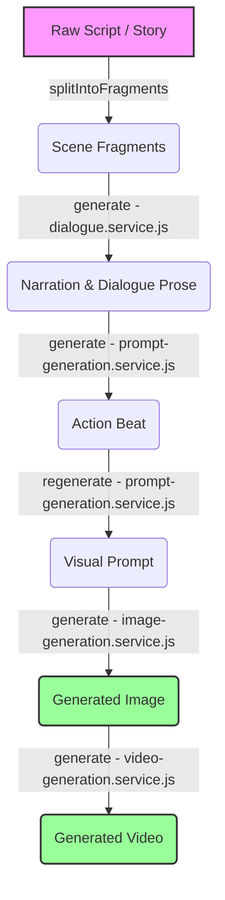

# Storyboard Image POC

Gemini-first POC for turning story text into a storyboard with editable prompts, serial image generation, scene versions, and per-style reference images.

## What changed in this version
- Gemini is now the default text and image provider (`gemini-3.5-flash` and `gemini-3.1-flash-image` by default)
- Each style now has its own character reference images and world reference images
- Reference images can be uploaded, previewed, and deleted in the UI
- Gemini uses scene-linked named references when generating images
- Starter reference images are included for all 5 styles

## Features
- Paste script or story text into a textarea
- Generate N storyboard scene prompts with Gemini or OpenAI
- Choose one of 5 styles stored as markdown prompt files
- Review and edit prompts in a storyboard grid
- Upload style-specific character references and world references
- Generate images serially with Gemini, OpenAI, or Dezgo
- Stop and resume serial generation
- Regenerate individual prompts and individual images
- Disable redundant batch prompt generation until the story or common prompt changes
- Preserve old images as scene versions and switch between them
- Preview each scene through one synchronized video/audio transport with seeking, silence padding, and video looping when audio is longer
- Reorder scenes
- Download selected scene images and a prompt-rich `storyboard.json` manifest as a ZIP
- Create and switch between autosaved storyboards in browser localStorage
- Validate and limit reference uploads to 8 images per category and 8 MB per image
- Warn when local fallback prompts are used because a text provider is unavailable
- Persist storyboards and generated media under a server-side project directory
- Serialize generation through a cancellable in-process queue
- Return one structured error shape from API endpoints

## Included styles
- Basic Cartoon
- Cinematic Reality
- Dark Gothic
- Indie Youtuber
- Vox Style

## Repo layout

This is a monorepo with two independently run, tested, and deployed apps, plus a thin root orchestrator:
```
apps/web/            Node/Express storyboard app -> deploys to Railway
apps/voice-service/  Python/FastAPI + Spark-TTS voice cloning daemon (GPU) -> deploys to Modal
package.json          root-level scripts only, no dependencies of its own
```
The two apps talk to each other over plain HTTP, configured entirely through environment variables (`SPARK_TTS_URL` on the web side) plus a shared bearer token (`SPARK_SERVICE_TOKEN`) — see [Deployment](#deployment) below. Each has its own `.env`/`.env.example`; there is no shared root `.env`.

## Quick start
1. Copy `apps/web/.env.example` to `apps/web/.env` and fill in at least `GEMINI_API_KEY`
2. Install dependencies:
   ```bash
   npm --prefix apps/web install
   ```
3. Start PostgreSQL and apply committed migrations:
   ```bash
   docker compose up -d postgres
   npm --prefix apps/web run prisma:migrate:deploy
   ```
4. (Optional) Install the local Piper voice engine for natural-sounding offline TTS:
   ```bash
   npm run setup:piper
   ```
5. Start the app:
   ```bash
   npm run dev:web
   ```
6. Open `http://localhost:3000`

Root-level scripts (`npm run <script>` from the repo root) drive both apps: `dev:web`, `dev:voice`, `check`, `test`, `setup:piper`, `setup:spark`.

## Local voices
- The audio provider dropdown includes two zero-API-key options: a rudimentary local voice (always available, no setup) and **Piper** (natural neural TTS, requires `npm run setup:piper` once — downloads a ~26 MB engine and a ~60 MB voice model into `apps/web/vendor/piper/`, not committed to git).
- ElevenLabs remains available as a cloud option when `ELEVENLABS_API_KEY` is set.
- Each detected speaker is auto-assigned a voice for the local providers; no manual mapping is required unless you're using ElevenLabs.

## Voice cloning (Spark-TTS, local GPU or Modal)
- The "Voice cloning (local, custom)" audio provider lets you record or upload a short sample directly in the app and get a custom voice for any character — Apache-2.0 licensed (commercial-safe), zero-shot cloning (no transcript required).
- Lives entirely in `apps/voice-service/`, a separate app from `apps/web` — see [Repo layout](#repo-layout). Requires an NVIDIA GPU (tested on an RTX 3060, 12 GB VRAM) and Python 3 to run for real; a CPU fallback exists but is realistically too slow for interactive use. One-time setup, run from the repo root:
  ```bash
  npm run setup:spark
  ```
  This creates `apps/voice-service/venv`, installs PyTorch + the Spark-TTS inference code, and downloads the `SparkAudio/Spark-TTS-0.5B` weights (~4 GB) into `apps/voice-service/pretrained_models/` — roughly 6-7 GB total, none of it committed to git.
- Copy `apps/voice-service/.env.example` to `apps/voice-service/.env` and set `SPARK_SERVICE_TOKEN` to match the same value in `apps/web/.env` (any random string works for local dev; if you leave it blank, the service stays open with a startup warning — fine locally, never for a real deploy).
- Start the voice-cloning daemon in its own terminal before selecting the provider in the UI:
  ```bash
  npm run dev:voice
  ```
  It loads the model once (a few seconds) and serves on `http://localhost:8001` (configurable via `SPARK_TTS_URL` on the `apps/web` side). The app shows a clear "unavailable" status if you pick this provider without it running, rather than failing silently.
- Cloned voices are stored under `apps/voice-service/voices/<voiceId>/` and are reusable across every speaker/scene/storyboard, the same way ElevenLabs voices are.

## Reference image behavior
- Style references live under `apps/web/style-references/<style-id>/characters` and `apps/web/style-references/<style-id>/world`.
- The app automatically loads the active style's references.
- Gemini image generation receives the active style's character and world references. Scene prompts stay focused on the visible action.
- OpenAI and Dezgo remain available as optional alternates.

### How to Set and Change Site Default Reference Images by Style

Site-wide default reference images are discovered dynamically from the filesystem. To configure them:

1. **Identify the Style ID**: 
   The style ID is the filename of the style's markdown file under `apps/web/styles/` without the `.md` extension (e.g., `basic-cartoon.md` has the ID `basic-cartoon`).
   *Note: Style IDs are sanitized/slugified when resolving directories.*

2. **Locate or Create the Directories**:
   Navigate to the style-references directory at `apps/web/style-references/`. Within it, find or create the subdirectories matching the style ID and the reference type:
   - For character references: `apps/web/style-references/<style-id>/characters/`
   - For world/environment references: `apps/web/style-references/<style-id>/world/`

3. **Add or Modify Image Files**:
   Place default image files directly in the respective directory.
   - **Supported Formats**: PNG, JPEG/JPG, WebP, and GIF.
   - **Ordering**: Images are loaded and sorted alphabetically by filename. If you want to enforce a specific order in the UI/payload, prefix the filenames with numbers (e.g., `01-character.png`, `02-expression.jpg`).
   - **Limit**: The system supports up to 8 reference images per category.

4. **Dynamic Reloading (No Restart Required)**:
   The application reads these directories dynamically at runtime (on request). Any files added, modified, or removed will instantly reflect in the UI and subsequent image generation runs without needing to restart the backend server or rebuild the application.

5. **Defining a New Style**:
   To create an entirely new style with default reference images:
   - Create a new markdown file under `apps/web/styles/<new-style-id>.md`. The first line should be the name of the style (e.g., `# Retro Future`), and subsequent lines define the prompt text.
   - Create directories `apps/web/style-references/<new-style-id>/characters/` and `apps/web/style-references/<new-style-id>/world/`.
   - Place your default reference images inside them. The application will auto-discover both the style and its default images.

## AI Generation Pipeline & Prompt Strategy

The Storyboard POC leverages a multi-stage, multi-modal AI pipeline to translate a narrative script into synchronized storyboard scenes with custom voices, visuals, and animations.

### AI Generation Types

The generation pipeline comprises six distinct AI capabilities:

| Generation Type | Model Roles & Functions | Input Data Sources | Output Format / Constraints |
| :--- | :--- | :--- | :--- |
| **Dialogue & Narration** | Adapts source screenplays/scripts into a natural, spoken-word narrative voiceover. Strips formatting markup, preserves verbatim dialogue, and handles scenic transitions. | Source script fragment + scene action beat | Paragraph prose (cleaned & length-capped to 6,000 characters). |
| **Action Beats** | Summarizes the scene text into a terse, active-voice summary of the main physical action. | Source script fragment | Caveman-simple present-tense phrase (5–24 words). |
| **Visual Prompts** | Converts the action beat into a detailed keyframe description focusing on subject, poses, and location composition without style keywords. | Action beat + script fragment + neighboring beats | Detailed scene description (15–40 words). |
| **Image Generation** | Renders style-consistent visuals by merging the style prompt, common modifiers, scene-level visual prompts, and visual references. | Visual prompt + Style template + Common prompt + Ref images | Image file (`PNG`, `JPEG`, `WebP`, or `GIF`). |
| **Video (Motion) Generation** | Animates a generated keyframe image based on the style and intensity of motion specified. | Generated image + Motion prompts (intensity & style motion guides) | Animated MP4 video. |
| **Audio & Voice (TTS)** | Generates speech for characters and narration using local/offline or API cloud models, including custom clone voices. | Spoken narration text + voice selection / clone recording | WAV or MP3 audio file. |

---

### Key Scripts & Prompts Reference

The prompts and prompt strategies are hardcoded into the following service layers:

- **Dialogue & Narration Generation**: [dialogue.service.js](file:///Ubuntu/home/administrator/web/basic-cartoon-poc/apps/web/src/services/dialogue.service.js)
  - Key Constants: `NARRATION_RULES_ENRICHED` (rules for cinematic descriptions), `NARRATION_RULES_LITERAL` (rules for strict script read-throughs), and `ATTRIBUTION_RULE` (guidelines to prevent repetitive "[Name] said" tags).
- **Prompt & Beat Generation**: [prompt-generation.service.js](file:///Ubuntu/home/administrator/web/basic-cartoon-poc/apps/web/src/services/prompt-generation.service.js)
  - Key Constants: `BEAT_RULES` (physical action structure guidelines) and `CONTINUITY_RULE` (rules to ensure characters remain identical in adjacent frames).
- **Image Generation Service**: [image-generation.service.js](file:///Ubuntu/home/administrator/web/basic-cartoon-poc/apps/web/src/services/image-generation.service.js)
  - Manages how style-specific templates from `apps/web/styles/` and character/world reference paths are fed to image generation models.
- **Video Motion Generation**: [video-generation.service.js](file:///Ubuntu/home/administrator/web/basic-cartoon-poc/apps/web/src/services/video-generation.service.js)
  - Key Constants: `INTENSITY_MOTION_PROMPTS` (subtle/medium/high presets), `STYLE_MOTION_PROMPTS` (style-specific physics guides), and `VIDEO_PROMPT_WORD_BUDGET`.
- **Style Templates**: Configured dynamically via markdown files inside `apps/web/styles/`, managed by [styles.service.js](file:///Ubuntu/home/administrator/web/basic-cartoon-poc/apps/web/src/services/styles.service.js).

---

### Prompt Strategy & Data Flow



1. **Deterministic Segmentation**: The raw script is parsed and split into `sceneCount` fragments using paragraph/sentence boundaries (see `splitIntoFragments` in [prompt-generation.service.js](file:///Ubuntu/home/administrator/web/basic-cartoon-poc/apps/web/src/services/prompt-generation.service.js)). This split is authoritative, ensuring AI models stay bounded to specific scene chunks.
2. **Narration Adaptation**: The LLM processes the fragment to extract spoken narration and dialogue. It operates under two modes:
   - **Enriched Mode**: Elaborates on atmosphere, sensory details, and scene headings.
   - **Literal Mode**: Remains strictly faithful to the text, only adding minimal action cues to keep the audio coherent.
3. **Physical Action Beat Summarization**: The LLM extracts a caveman-simple summary (the "Beat") using present tense, helping frame-level generation focus on a single physical motion.
4. **Visual Prompt Generation**: The Beat is expanded into a camera-agnostic description of composition, pose, subjects, and objects. The generator is provided with neighboring context (`previousBeat` and `nextBeat`) to align characters and visual continuity.
5. **Image Assembly**: The prompt sent to the image provider combines style rules + common prompt overrides + scene visual prompt + user additions. Reference images (character and world assets) are sent alongside the prompt text (up to 14 images on Gemini) to maintain consistent identities.
6. **Video Motion Assembly**: Motion is generated by sending the final image, plus a prompt mixing the story action, motion intensity directives (subtle/medium/high), and style-specific motion characteristics (e.g., snappy cartoon recoil vs. heavy gothic drift).

---

### Tuning Prompts & Responses (Developer Guide)

When fine-tuning prompt templates, behaviors, or word limits, follow these development guidelines:

#### 1. Invalidate Caches After Prompt Updates
The application uses exact-input caching to prevent redundant API calls when regenerating prompts and narration. If you edit any prompt templates or rules (e.g. `BEAT_RULES` or `NARRATION_RULES_ENRICHED`), you **must** increment the template version flags so that the system invalidates older cache entries:
- In [prompt-generation.service.js](file:///Ubuntu/home/administrator/web/basic-cartoon-poc/apps/web/src/services/prompt-generation.service.js): Increment `PROMPT_TEMPLATE_VERSION` and `ACTION_TEMPLATE_VERSION`.
- In [dialogue.service.js](file:///Ubuntu/home/administrator/web/basic-cartoon-poc/apps/web/src/services/dialogue.service.js): Increment `NARRATION_TEMPLATE_VERSION`.

#### 2. Fine-Tuning Style Prompt Templates
To customize an existing style or add a new one:
1. Locate the markdown file under `apps/web/styles/<style-id>.md`.
2. The first line **must** be a header defining the style name (e.g., `# Retro Synthwave`).
3. Subsequent lines should contain the style tokens, aesthetic descriptors, and lighting cues (e.g., `Vibrant neon palette, volumetric lighting, scanlines, digital grit...`). Keep style templates descriptive but avoid camera movements or subject specificities.

#### 3. Adjusting Prompt Word Budgets
If you find that the models are generating overly long prompts that exceed API payload limits or cause generation drift, you can adjust word budgets inside:
- **Video Prompts**: Update the `VIDEO_PROMPT_WORD_BUDGET` rules in [video-generation.service.js](file:///Ubuntu/home/administrator/web/basic-cartoon-poc/apps/web/src/services/video-generation.service.js).
- **Visual Prompts**: Update `limits.prompt` in the dependency injection configuration (which maps to limits enforced in `prompt-generation.service.js`).

#### 4. Editing LLM Directives & Instruction Constraints
If the model habitually fails on specific aspects (e.g., repeating character names, using passive voice, or generating camera cuts):
- Update the rule definitions in [dialogue.service.js](file:///Ubuntu/home/administrator/web/basic-cartoon-poc/apps/web/src/services/dialogue.service.js) (e.g. `ATTRIBUTION_RULE` or `NARRATION_RULES_ENRICHED`).
- Update `BEAT_RULES` in [prompt-generation.service.js](file:///Ubuntu/home/administrator/web/basic-cartoon-poc/apps/web/src/services/prompt-generation.service.js) to enforce stronger present-tense physical verbs.

## Storage
- Storyboards are cached in localStorage for responsive editing and synchronized to `apps/web/data/projects/<project-id>/project.json`
- Project images, audio, video, and exports live under `apps/web/data/projects/<project-id>/assets/<type>`
- Project writes use monotonic revisions and stale `If-Match` updates return `409 REVISION_CONFLICT`
- Legacy `/generated`, `/audio`, and `/videos` version paths are copied into the owned project asset tree during normalization instead of being discarded.
- Generation requires a project and an `Idempotency-Key`; legacy public media mounts are disabled
- `POST /api/projects/:projectId/cleanup` removes assets no longer referenced by the project document
- `DELETE /api/projects/:projectId` cancels its active jobs and removes the entire project tree
- Deleted project IDs are tombstoned and cannot be recreated by late jobs

## Pipeline API

- Generation responses include `X-Generation-Job-Id`; jobs can be listed at `GET /api/jobs` and cancelled with `DELETE /api/jobs/:jobId`
- Job state is persisted under `apps/web/data/jobs`; queued/running work is recovered as `interrupted` after restart
- Text requests accept `fallbackPolicy: "fail" | "local"`. The UI defaults to `fail`, so local fallback is never silently selected.
- API failures use `{ "ok": false, "error": { "code", "message", "retryable", "requestId", "details"? } }`
- ZIP exports place selected assets in `images/`, `audio/`, and `videos/`, and include `storyboard.json`

## Composition root

- `apps/web/server.js` only loads configuration, creates dependencies and the Express app, starts the listener, and exposes compatibility test exports.
- `apps/web/src/app.js` owns middleware/route registration; route modules contain URL composition only.
- Controllers translate HTTP requests, services own generation and persistence workflows, providers own external API construction, and `apps/web/src/media` owns format/stub utilities.
- Services receive their storage/provider dependencies from `apps/web/src/dependencies.js` and have direct unit coverage in `apps/web/test/services.test.js`.

## Deployment

**Nothing is deployed yet** — this section documents the boundary that's ready, not something live.

- **`apps/web` → Railway.** `apps/web/Dockerfile` + `apps/web/railway.toml` are ready. Railway's Hobby tier has no GPU on any plan (confirmed directly against their docs), which is exactly why voice cloning lives in a separate app instead. One manual step this repo can't do for you: in the Railway dashboard, create a service pointed at this repo and set its **Root Directory** to `apps/web` — `railway.toml` lives inside that directory specifically because Railway resolves it (and its `watchPatterns`) relative to whatever Root Directory is configured.
- **`apps/voice-service` → Modal.** `apps/voice-service/modal_app.py` defines the deployment (GPU function serving the existing FastAPI app via `@modal.asgi_app()`, model weights baked into the image, cloned voices on a persistent Modal Volume) but is **not deployed**. Before running `modal deploy apps/voice-service/modal_app.py` for real, you'd need a Modal account plus a one-time `modal secret create voice-service-secrets SPARK_SERVICE_TOKEN=... SPARK_TEMPERATURE=0.8 ...` and `modal volume create voice-service-voices`.
- **CI**: `.github/workflows/ci.yml` runs Node checks/tests and mocked voice-service tests (no GPU, no real model — `SPARK_SKIP_MODEL_LOAD=1`) on every push/PR. `.github/workflows/deploy-modal.yml` is `workflow_dispatch`-only (never triggers automatically) and additionally requires `MODAL_TOKEN_ID`/`MODAL_TOKEN_SECRET` repo secrets that aren't configured yet.
- **Service-to-service auth**: `apps/web` sends `Authorization: Bearer <SPARK_SERVICE_TOKEN>` on every call to `apps/voice-service` except the health check. Both apps' `.env` files must have the same value. Once Modal is live, point `apps/web`'s `SPARK_TTS_URL` at the Modal URL and update `SPARK_SERVICE_TOKEN` to match the Modal secret — no code changes either side.

## Authentication and quotas

- Set `DATABASE_URL` locally and in production. Prisma/PostgreSQL is authoritative for users, workspaces, memberships, and sessions.
- `AUTH_TOKENS` remains available only as a test/local compatibility adapter.
- Every account receives a personal workspace. Project documents, jobs, generation, exports, and asset downloads enforce workspace ownership.
- Set `ADMIN_OWNER_IDS` to the comma-separated user IDs that bootstrap the admin console and shared-resource administration.
- `PROJECT_MAX_FILES` and `PROJECT_MAX_BYTES` set per-project asset limits.
- Run remote deployments behind TLS and keep bearer tokens out of URLs and logs.

### Create the initial administrator

`ADMIN_OWNER_IDS` is the bootstrap mechanism for the first administrator. It grants admin access without directly editing the database or bypassing the application's authorization checks.

1. Start the application and create the first account at `http://localhost:3000/login.html?mode=register`.
2. Find that account's UUID:
   ```bash
   docker compose exec postgres psql -U storyboard -d storyboard \
     -c 'SELECT id, email, platform_role FROM users ORDER BY created_at;'
   ```
3. Add the UUID to `apps/web/.env`:
   ```dotenv
   ADMIN_OWNER_IDS=00000000-0000-0000-0000-000000000000
   ```
   Multiple bootstrap administrators can be supplied as a comma-separated list.
4. Restart `apps/web`, log in with that account, and open `http://localhost:3000/admin` (an **Admin** link also appears in the authenticated top bar).

The bootstrap administrator can use **Admin → Users** to grant `admin` or `super_admin` to other accounts. Those roles are stored in PostgreSQL and do not depend on `ADMIN_OWNER_IDS`. An administrator cannot change their own role, and only a bootstrap administrator or existing `super_admin` can grant `super_admin`; this prevents accidental loss or escalation of administrative access. For a fully database-backed handoff, create a second account, promote it to `super_admin`, sign in as that account, and then promote the original account if desired.

In production, `ADMIN_OWNER_IDS` has no implicit fallback and must be configured explicitly for bootstrap access. Keep it set until at least one database-backed `super_admin` has been verified. Removing it does not change previously assigned database roles.

### Stripe one-time credit purchases

Stripe Checkout is used only for one-time credit-pack purchases; subscriptions and Stripe Connect are not part of this integration. Configure both Stripe secrets before exposing Checkout:

```dotenv
PUBLIC_APP_URL=http://localhost:3000
STRIPE_SECRET_KEY=sk_test_...
STRIPE_WEBHOOK_SECRET=whsec_...
```

For local webhook testing, install the Stripe CLI, sign in, and forward events to the raw-body endpoint:

```bash
stripe listen --forward-to localhost:3000/api/webhooks/stripe
```

Use the `whsec_...` value printed by that command in `apps/web/.env`; it is different from the secret for a Dashboard-managed production endpoint. Register `/api/webhooks/stripe` in Stripe for at least:

- `checkout.session.completed`
- `checkout.session.async_payment_succeeded`
- `checkout.session.expired`
- `refund.created`
- `charge.dispute.created`

The migration seeds Starter, Creator, and Studio as draft database records. In Stripe, create matching one-time USD Prices with the same amount and tax behavior, then open **Admin → Pricing & sales → Stripe credit packs** and publish each draft with its `price_...` ID. Publishing retrieves the Price from Stripe and rejects mismatched currency, amount, tax behavior, inactive, or recurring Prices. Published pack terms cannot be edited; create a new pack version when price or granted credits change.

Customers purchase from `/credits`. The browser redirect never grants credits: the success page polls the internal sale status while the signed webhook atomically funds the tenant ledger. Keep `BILLING_CUSTOMER_CHARGING_ENABLED=false` while validating paid-credit funding; this flag controls generation deductions, not the ability to purchase credits.

### Free-user welcome credits

New personal accounts receive the currently active welcome-credit policy during the same database transaction that creates their user, workspace, and membership. The migration seeds `welcome-v1` at 1,000 site credits as an initial development value. An administrator can replace it under **Admin → Pricing & sales → New-user welcome credits** after validating the amount needed for approximately 10–12 complete scenes across text, image, audio, and video.

Welcome-credit policies are immutable versions. Activating a new version affects only accounts registered afterward; existing balances and historical `welcome_grant` ledger entries retain the exact policy version and amount they received.

See [the multi-tenant foundation](docs/multi-tenant-foundation.md) for the ownership model and remaining migration work.

## POC stakes
1. Convert pasted narrative text into a controllable visual sequence.
2. Keep recurring characters and worlds recognizable through the selected style references.
3. Keep prompts and images independently editable while preserving version history.
4. Keep serial generation interruptible, resumable, and exportable.

## Intentionally stubbed
- Select `Stub Preview (no API)` to exercise the full image workflow without API keys.
- Stub previews are simple SVG storyboard cards, not generated art.
- Databases, cloud storage, billing, collaboration, and final assembly are deferred.
