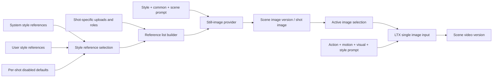

# Reference Image Deep Dive and Video Provider Proposal

Status: implementation assessment, completed foundation, and provider proposal
Date: 2026-07-20

## Implementation update

The reference-control foundation proposed here is now implemented:

- A narrative scene owns an implicit generation unit at `scene.shots[0]`.
- Image prompt/version ownership and video version ownership have moved into that shot boundary.
- Legacy scene-level image/video fields load through read-only compatibility projections and are no longer persisted or dual-written.
- Newly generated image and video versions carry an immutable generation manifest plus a canonical manifest hash.
- Image manifests record the resolved prompt components, style, provider/model, request settings, consumed references in provider order, provider-limit omissions, and provider request ID.
- Video manifests record prompt components, style, provider/model, request settings, motion intensity, and the exact selected start/end frame paths plus SHA-256 hashes.
- Manifest-aware image/video staleness compares the stored hash with current user-controlled inputs. Older outputs without manifests retain the legacy staleness checks.
- Reference inputs are now canonical at `scene.shots[0].referenceBindings[]`; the former scene-level fields are read-only compatibility projections and are not persisted or dual-written.
- The first role vocabulary is intentionally small: `character`, `location`, `composition`, and `continuity`. Existing unclassified scene uploads migrate to `composition`.
- The scene reference modal lets users classify an uploaded reference with those four simple labels.
- Gemini now receives a numbered, role-specific instruction immediately before each inline image instead of the generic text `Reference image`.
- Image manifests record each consumed or provider-omitted reference with its role, source, order, and provider slot. Reference-role changes therefore participate in manifest-hash staleness.
- Still-image providers now publish machine-readable reference capabilities. A shared resolver creates the included/excluded plan before the adapter call: Gemini gets up to 14 role-aware inline references, OpenAI gets up to eight edit inputs, Dezgo gets one explicit image-to-image anchor, and stub consumes none.
- Final provider adapters no longer silently truncate reference arrays. They reject an unplanned overflow, while the resolver records every omission and reason in the manifest and generation response.
- Paid still-image generation now runs an exact server preflight. When references will be omitted, the UI shows the used/total count and requires confirmation before submission. The confirmed plan hash is revalidated server-side so a changed plan cannot spend against stale consent.
- Normal storyboard UI stays deliberately compact: image/video version history shows the provider name, while full provenance remains stored for token/cost analysis and debugging rather than receiving a dedicated panel.
- Every implicit shot now has `startFrame` and nullable `endFrame` path selections separate from image versions. Existing shots default `startFrame` to their active image without duplicating the asset.
- Video providers publish start/end capability flags. Current LTX advertises start-frame support only, receives only the selected start frame, and exposes no end-frame controls.
- Changing either selected frame changes manifest-based video staleness. A selected but unsupported end frame is recorded as unconsumed rather than being sent to LTX.

Multiple shots, end-frame generation behavior, the isolated LTX keyframe experiment, durable commercial jobs, and additional video providers remain proposed work rather than implemented behavior.

## Executive conclusion

The working assumptions are mostly correct, with one important wording correction:

- The app does send the selected style's character/world references to every **scene image generation** unless a user disables a default for that scene.
- The app also supports up to eight **shot-specific reference uploads** through the existing scene-card UI. These are ordered before style defaults and therefore win when the capability resolver must omit inputs beyond a provider limit.
- The app does **not** send those raw character/world/shot-specific references directly to LTX. It sends the shot's explicitly selected `startFrame` as LTX's single image-to-video input. Existing projects initialize that selection from the active image. The influence of earlier references is baked into the selected frame indirectly.
- The current LTX HTTP service accepts only one `image`. It has no end-frame or multiple-keyframe field, so first/last-frame generation cannot be tested through today's endpoint without changing the LTX runtime and API.
- Reference roles are now explicit at the shot boundary. The deliberately narrow first vocabulary is `character`, `location`, `composition`, and `continuity`; product/prop/pose-specific roles are deferred until usage proves they are needed.
- New image versions save immutable reference provenance in their generation manifests. Role, order, inclusion, provider omission, prompt, model, and relevant setting changes participate in the canonical staleness hash.

The app now has **scene as the narrative unit and shot as the generation unit**, role-based references, immutable manifests, Gemini role labels, neutral still-reference resolution, paid-generation preflight consent, and explicit shot-level frame selections. The next step is the isolated LTX keyframe experiment, followed by the commercial video job/capability layer for Veo. The current flat storyboard should remain the user experience until real multi-shot editing is needed.

## Terminology to standardize

The current product uses “reference image” for several different jobs. That ambiguity is now affecting both the UI and the code.

| Proposed term | Meaning | Current representation |
|---|---|---|
| Style reference | Reusable visual baseline for a selected style; normally character look or world look | Files under `style-references/<style>/characters` and `world`, plus user style uploads |
| Shot reference | An ingredient that should influence still-image generation for the implicit shot | `scene.shots[0].referenceBindings[]` |
| Shot image / keyframe | The composed image that depicts a particular shot | `scene.shots[0].versions[]`; UI sometimes calls it a “generated reference image” |
| Start frame | The image that must initialize a video shot | `scene.shots[0].startFrame`, a path referencing an existing image version |
| End frame | The image that should constrain the final video frame | Nullable `scene.shots[0].endFrame`; modeled but not exposed or consumed by current LTX |
| Content reference | Character, location, composition, or continuity input | Typed with the first four-role vocabulary |
| Style reference for a provider | An image meant to transfer visual treatment rather than content | Not distinguished from content |
| Motion reference | A video used for movement, performance, or camera direction | Not represented |
| Generation provenance | Exact assets, roles, prompts, provider/model, settings, and omissions used for one output | Immutable generation manifest on new image/video versions |

“Site reference” is not a precise implementation term today. The visible defaults are actually **style-scoped**; user-uploaded additions are also style-scoped and user-owned. They are not stored on a project. The UI currently calls them “Project default references,” which obscures this distinction.

## Current system: actual data flow



### 1. Style references

The style service reads global files first and user files second, sorting each group by filename. It selects up to four character images and four world images, with a hard maximum of eight style references (`apps/web/src/services/styles.service.js:52-78`).

The repository's checked-in defaults currently contain:

| Style | Character images | World images | Total sent by default |
|---|---:|---:|---:|
| `basic-cartoon` | 2 | 2 | 4 |
| `cinematic-reality` | 1 | 1 | 2 |
| `dark-gothic` | 1 | 1 | 2 |
| `indie-youtuber` | 1 | 1 | 2 |
| `money-wolf` | 1 | 1 | 2 |
| `vox-style` | 1 | 1 | 2 |

Therefore, the observation that “the same two images are used for every scene” is exactly true for five of the six checked-in styles. `basic-cartoon` currently sends four. User uploads can raise the selected style set to eight.

Every implicit shot begins with every selected style reference enabled. The scene reference modal lets the user disable individual defaults for that shot. The canonical list is `scene.shots[0].disabledStyleReferencePaths[]`; the former misleading `disabledProjectReferenceImages` name is now compatibility-only.

### 2. Shot-specific references

A user can upload up to eight images through a scene card. They are stored as project image assets and recorded canonically in `scene.shots[0].referenceBindings[]`. Each binding has one of four roles: `character`, `location`, `composition`, or `continuity`. Uploads default to `composition`; the user can change the role in the reference modal.

These files are ingredients for the next still-image generation. They do not become image versions and are not independently passed to the current video provider.

The generic image library is a separate path:

- It can generate or upload reusable images into project asset storage.
- Selecting one in `scene-image` mode copies it into a scene image version.
- Selecting an image as a character/world reference copies it into the user style-reference directory.
- The shot-reference modal itself is upload-oriented; the library and shot-reference concepts are not unified.

This explains why an image can look like a “reference” in the library, become a “scene image” in one workflow, or become a persistent style default in another.

### 3. Still-image reference assembly

At generation time the service:

1. Resolves valid shot-specific reference bindings and preserves their roles.
2. Resolves the selected style references and filters the defaults disabled for this shot. Character defaults infer `character`; world defaults infer `location`.
3. Concatenates `shot-specific references` first, then `style defaults`.
4. Passes the ordered candidates through the provider-neutral capability resolver.
5. Produces an explicit plan containing included references, provider slots, excluded references, and omission reasons before calling the adapter.
6. Sends only the planned inputs to the adapter. The adapter rejects overflow rather than applying another hidden truncation.

The implemented limits are:

| Image provider | Resolver limit | Planned transport behavior |
|---|---:|---|
| Gemini | 14 | Sends up to 14 role-labeled inline images |
| OpenAI | 8 | Switches from image generation to `/v1/images/edits` and sends the planned `image[]` inputs |
| Dezgo | 1 | Switches to `image2image`; the one planned reference becomes `init_image` |
| Stub | 0 | Consumes no references; every candidate is recorded as `provider_does_not_consume_references` |

Capability resolution is shared between server generation and browser staleness through `src/shared/image-reference-plan.js` and `public/modules/image-reference-plan.js`. Provider transport remains isolated in `src/providers/image/index.js`.

Consequences:

- Shot-specific images have priority, which is a good default.
- Omission is no longer silent: the response and immutable manifest identify every excluded asset and reason, and paid generation requires confirmation of the exact plan hash before submission. The confirmation stays concise—used versus total and omitted count—rather than exposing provider slots or manifest internals.
- With eight shot references and eight style references, Gemini receives the eight shot references plus the first six defaults. The remaining two are explicitly recorded as `provider_limit` omissions. Ordering within the style group is character first, then world, so world references remain most likely to be excluded until role-priority planning is introduced.
- With Dezgo, the first shot reference becomes the sole `init_image`. If no shot reference exists, the first character style reference becomes the anchor. This choice is deterministic and auditable, but still role-agnostic; Dezgo is an image-to-image transformation, not a multi-reference compositor.
- The generated image version now retains the consumed and omitted bindings in its immutable manifest, including role, source, order, provider slot, and omission reason.

### 4. Gemini behavior—the first role-aware adapter

The current model default is `gemini-3.1-flash-image`, sent through `v1beta/models/{model}:generateContent`. The request now contains:

1. One composed text prompt.
2. For each input image, a numbered semantic instruction for `CHARACTER IDENTITY`, `LOCATION IDENTITY`, `COMPOSITION`, or `PREVIOUS SHOT CONTINUITY`.
3. The inline image bytes.

This removes the worst ambiguity from the former anonymous-image request while keeping the first product model simple. The adapter can now distinguish identity, place, framing/blocking, and continuity without requiring subject IDs or a large taxonomy.

This leaves capability on the table. Google's current Gemini image documentation says `gemini-3.1-flash-image` excels at multiple-reference processing and supports high-fidelity handling for up to ten object images plus character resemblance for up to four characters. The documentation also recommends including previously generated images in later generations for continuity and adding a pose reference for complex poses. See [Gemini image generation and reference-image limits](https://ai.google.dev/gemini-api/docs/image-generation).

The important product implication is that a larger bag of anonymous images is not the goal. Gemini now receives role-aware multimodal input in this form:

```text
Create the requested shot.

REFERENCE IMAGE 1 — CHARACTER IDENTITY. Preserve the depicted character's identity, appearance, proportions, clothing, and distinguishing features. Do not treat the background as a location requirement.
[image]

REFERENCE IMAGE 2 — LOCATION IDENTITY. Preserve the depicted place, layout, architecture, materials, and environmental details while allowing the requested camera view.
[image]

REFERENCE IMAGE 3 — COMPOSITION. Use this image for framing, camera angle, blocking, pose, or spatial arrangement. Do not copy unrelated identity or style details.
[image]
```

The Gemini adapter builds these labels from typed bindings. The same role model can map differently for OpenAI, Dezgo, Veo, Seedance, or LTX.

Gemini-specific recommendations:

- Keep `gemini-3.1-flash-image` as the default high-volume still-image provider for now.
- Keep the four-role vocabulary until real projects demonstrate a need to split product, prop, pose, or style into separate roles.
- Include a prior shot image only when explicitly bound as `continuity`; the adapter labels it `PREVIOUS SHOT CONTINUITY`, not style or identity.
- Reserve slots intentionally: e.g. up to four character identities, then products/props, location, composition/pose, prior-shot continuity. Do not fill all 14 automatically just because the API allows it.
- Add an optional premium still-image tier for complex shots. Google's current documentation positions Gemini 3 Pro Image for complex professional work, while Flash Image is the general workhorse.
- Evaluate migration from the raw legacy-style `generateContent` integration to Google's current Interactions API, but keep that migration separate from the reference data-model change.

### 4a. OpenAI behavior

OpenAI receives no reference images through its ordinary generation request. As soon as the resolved plan contains a reference, the adapter changes endpoints to `/v1/images/edits` and appends the planned files as `image[]`. The resolver enforces the eight-input limit; the adapter does not slice again. Unlike Gemini, OpenAI does not yet receive per-image role labels, so role meaning must still be inferred from the shared prompt and array order.

The configured default is `gpt-image-1`. OpenAI's current catalog labels GPT Image 1 as a previous/deprecated image model and identifies GPT Image 2 as the current state-of-the-art image generation/editing model. See [GPT Image 1](https://developers.openai.com/api/docs/models/gpt-image-1) and [GPT Image 2](https://developers.openai.com/api/docs/models/gpt-image-2).

Recommendations:

- Validate GPT Image 2 edit behavior and pricing, then move the model choice to an administered provider capability record rather than leaving a stale default in code.
- Build an OpenAI-specific prompt preamble that numbers and describes each supplied image from the typed bindings.
- Keep the app's eight-image limit only if contract tests confirm it for the selected model/endpoint; provider limits should be model capabilities, not hardcoded provider-name branches in the generation service.
- Record that the operation was an edit/multi-image composition, not plain text-to-image generation.

### 4b. Dezgo behavior

Dezgo is not acting as a multi-reference compositor in this app. With any reference present, it switches to `image2image`, uses only `references[0]` as `init_image`, and applies `DEZGO_REFERENCE_STRENGTH` (default `0.65`).

That makes reference order decisive:

- first shot-specific reference, if present
- otherwise first enabled character style reference
- otherwise, only if no character reference exists, first world reference

For the proposed role model, expose Dezgo as a single `image_to_image_anchor` capability. If a generation has several required identities/locations, fail capability validation or route to Gemini/OpenAI; do not imply that Dezgo used all references. A user should explicitly choose the anchor and strength.

### 4c. Stub behavior

The service reports a reference count for stub generation, but the stub renderer does not consume the files. Mark its manifest entries as `not_consumed_by_stub` so tests and UI do not suggest visual influence that did not occur.

### 5. Image version creation and staleness

Each still result is saved in `scene.shots[0].versions[]` with its immutable generation manifest. The version and manifest include:

- `path`
- the composed prompt
- the raw scene prompt
- provider
- timestamp

- provider and model
- resolved prompt components
- selected reference paths, roles, sources, order, and provider slots
- references excluded by provider limits and why
- relevant provider request settings
- canonical immutable manifest hash

Manifest-aware image staleness recomputes the canonical hash from current user-controlled inputs. Older versions without a manifest retain the prior compatibility check.

### 6. Current video generation and LTX

The UI picks the active scene image version and sends only its path as `imagePath` (`apps/web/public/modules/workflows.js:583-617`). The video service resolves it to a local asset and passes one `imagePath` into the provider (`apps/web/src/services/video-generation.service.js:65-87`).

The LTX adapter copies that one image to the shared directory and calls the local `/generate` endpoint with:

- one `image`
- prompt and negative prompt
- motion intensity
- width/height
- frames/frame rate
- steps, guidance, and seed
- output path

See `apps/web/src/providers/video/index.js:48-105`.

The separately deployed local service confirms the constraint. Its request schema has one optional `image` and uses Hugging Face Diffusers' `LTXImageToVideoPipeline`; there is no `last_image`, end frame, or keyframe array (`/home/administrator/web/ltx-env/server.py:80-100, 225-287`). It currently runs the generic Lightricks LTX-Video 0.9.8-era pipeline, not LTX-2.

So the precise current behavior is:

> style and scene references → Gemini/OpenAI/Dezgo still generation → one composed shot image → LTX first-frame conditioning → video

That is a reasonable basic pipeline. It is not multi-reference video generation.

Video versions now also carry immutable manifests containing the start frame, composed prompt inputs, provider/model, motion intensity, and relevant provider settings. Manifest-aware staleness compares that full effective input snapshot; older versions retain the source-image compatibility check.

## Assumption verdicts

| Assumption | Verdict | Detail |
|---|---|---|
| “We use the user's site reference images for every image generation.” | Mostly confirmed | Enabled references for the selected style are reused for every scene still. They are style-scoped, not truly site- or project-scoped. Scene-level toggles can disable them. |
| “We use the same two references for every scene.” | Confirmed for most checked-in styles | Five styles have one character plus one world default. `basic-cartoon` has four defaults. |
| “Scene images are references through LTX.” | Confirmed | The active scene image is the one and only LTX image input. It acts as the initial conditioning frame. |
| “Shot-specific references are sent through LTX.” | Not directly | They can influence the generated shot image, which then influences LTX, but LTX never receives them as separate assets. |
| “We can test start and stop images on current LTX.” | Not with the current endpoint/runtime | The app and local LTX service accept only one image. LTX's newer official stack supports multiple keyframes, but this deployment must be upgraded or replaced first. |

## Why the current approach works for stick figures but will plateau

Simple work has low identity and composition entropy. A single character sheet, a single world reference, and a short prompt can be enough because there are few details to contradict.

Complex commercial scenes add competing constraints:

- multiple characters and products
- exact logos, wardrobe, props, or packaging
- a location that must remain stable while the camera changes
- pose/blocking and camera composition
- continuity with the previous and next shots
- style direction that should not overwrite product identity
- a required start state and a required end state
- motion or performance references

The former untyped list could not tell a provider which facts were invariant and which could be borrowed loosely. The new four roles remove the broadest ambiguity, but provider-aware planning is still needed: repeating a global world image can fight a shot-specific location, and a character group sheet can pull unwanted characters or composition into a product shot. Increasing the list size still increases cross-contamination unless inclusion and priority are deliberate.

## Target product model: project → scene → shots

A scene should remain the narrative unit. A **shot** should become the generation unit.

```text
Project
  shared visual bible / reusable subjects
  Scene
    narrative beat, narration, continuity intent
    Shot 1
      image prompt
      reference bindings
      shot image versions
      selected start frame
      selected end frame
      video generations
    Shot 2
      ...
```

The implicit shot boundary avoids overloading narrative scene fields with images that may later represent different cameras and time states.

### Internal model now; multi-shot UX later

This proposal does **not** recommend building a full Project → Scene → Shots editing experience yet. Introduce the boundary internally while preserving the current flat storyboard:

- Add canonical `scene.shots[]` to the persisted model.
- Adapt every legacy scene without `shots[]` to one implicit shot.
- Project `shots[0]` through the current scene-card API/UI shape so existing image, video, timeline, and export screens continue to behave as they do today.
- Put generation-owned fields—image prompt/versions, reference bindings, start/end frames, video versions, and generation manifests—on the shot.
- Keep narrative fields—script fragment, narration, beat, scene title, and scene ordering—on the scene.
- Avoid two writable sources of truth. Legacy `scene.versions[]` and `scene.videoVersions[]` should be read-compatibility inputs or derived projections, not independently mutable copies once the migration is active.
- Do not expose “Add shot,” nested shot navigation, or multi-shot timeline controls until a validated workflow requires more than one shot in a narrative scene.

The near-term product should still look like one card per scene. The architectural gain is that every generation now belongs to a shot, so adding a second camera setup later does not require another data-model rename or reinterpretation.

### Implemented reference binding

```json
{
  "path": "/projects/.../assets/images/...png",
  "name": "Mara turnaround",
  "role": "character"
}
```

Implemented roles:

- `character`
- `location`
- `composition`
- `continuity`

This intentionally avoids `subjectId`, priorities, scopes, and per-binding free-form instructions in the first slice. Those fields should be added only when a concrete workflow requires them. Start/end frames belong to the later video request model, not this still-image role list.

### Inheritance and overrides

Future multi-scope references should use explicit inheritance:

1. Project visual bible bindings
2. Scene bindings
3. Shot bindings
4. Per-generation overrides

More specific scopes should not merely append; they should be able to replace or disable inherited bindings by role and, if later introduced, a simple subject label. For example, Shot 3 could replace the scene's location without losing its character references.

The UI should show an “Effective inputs for this generation” list before spend:

| Asset | Role | Source | Included? | Reason |
|---|---|---|---|---|
| Mara turnaround | Character identity | Project | Yes | Required identity |
| Red mug packshot | Product identity | Shot | Yes | Required product |
| Default world | Location/style | Style | No | Replaced by shot-specific kitchen |
| Pose sketch | Pose | Shot | Yes | Composition control |

## Clamp reference use deliberately

The server now resolves still-image bindings into a provider-neutral **reference plan** before calling an adapter.

```json
{
  "included": [
    { "bindingId": "...", "providerSlot": "referenceImages[0]", "role": "character" }
  ],
  "excluded": [
    { "bindingId": "...", "reason": "provider_limit", "detail": "Veo supports three asset references" }
  ],
  "warnings": []
}
```

Implemented rules for still generation:

- Never silently call `.slice()` at the final provider boundary.
- Preserve deterministic candidate order: shot-specific bindings first, then enabled style defaults.
- Apply the selected provider's declared limit and supported roles before submission.
- Reject adapter overflow so every provider input must come from the resolved plan.
- Return exclusions and reasons to the client and save them in the immutable manifest.
- Include the ordered resolved bindings in the canonical manifest hash used for staleness.

Future rules:

- Add explicit priority and required/optional semantics when real workflows require them.
- Fail before charging when a required binding cannot be represented.
- Warn and request confirmation before spend when optional bindings will be omitted.
- Add immutable asset checksums so replacing file contents at the same path changes the manifest hash.
- Do not automatically send style defaults to video providers. The composed start frame already carries style; direct video references should be intentional.

## Provider-neutral video request

Replace the current one-image provider signature with a capability-driven contract:

```js
{
  provider: 'ltx' | 'veo' | 'seedance' | 'higgsfield',
  model: '...',
  prompt: '...',
  startFrame: assetOrNull,
  endFrame: assetOrNull,
  references: [{ asset, role, label, instruction, priority }],
  motionReferences: [],
  audioReferences: [],
  settings: { durationSeconds, aspectRatio, resolution, fps, seed, generateAudio }
}
```

Each adapter should publish capabilities, for example:

```js
{
  supportsStartFrame: true,
  supportsEndFrame: false,
  maxContentReferences: 0,
  maxMotionReferences: 0,
  supportsNativeAudio: false,
  transport: 'local-path',
  execution: 'synchronous'
}
```

Capability validation belongs before provider submission. Provider adapters should map the neutral request to local paths, inline bytes, a provider upload API, or short-lived signed URLs as appropriate.

## Provider assessment and integration order

Provider capabilities change quickly. The statements below are verified against vendor documentation available on 2026-07-20; capability discovery and contract tests should still gate production enablement.

| Provider | Relevant reference capability | Fit for this product | Recommendation |
|---|---|---|---|
| Current local LTX | One initial image through the deployed endpoint | Cheap iteration and baseline I2V | Keep as local baseline; do not claim end-frame support |
| Newer LTX stack | Official LTX project documents multi-keyframe conditioning | Best place to test start/end and keyframe UX without per-call premium spend | Upgrade in a separate service and run the first-frame/last-frame experiment before replacing current LTX |
| Veo 3.1 | Initial image, last frame, and up to three asset references; native audio | Strong premium hero-shot provider and clean match for the proposed roles | First commercial integration |
| Seedance 2.0 | Text/image/audio/video multimodal input; up to nine images, three videos, and three audios in the model's official launch materials; BytePlus documents first/last frame roles | Strongest fit for complex commercial/multi-reference scenes | Second commercial integration; prefer direct BytePlus/ModelArk contract |
| Higgsfield | Product supports first/last images, motion reference, Soul ID, and many routed models | Valuable creative platform, but not currently a normal public REST provider | Treat as a separate enterprise/MCP/CLI integration track, not a drop-in render adapter |
| Gemini Omni Flash | Simultaneous text/image/audio/video input and conversational video editing | Potentially excellent future multimodal iteration provider | Add to evaluation after Veo; it is preview and uses a different interaction model |

### LTX: first/last-frame test plan

The official Lightricks project now advertises multiple-keyframe conditioning, keyframe animation, and newer LTX-2 capabilities. See the [official LTX repository](https://github.com/Lightricks/LTX-Video).

However, the deployed service is based on the older single-image Diffusers pipeline. Do not add an `endFramePath` field to the web app and pretend it is honored. Instead:

1. Stand up a separate `ltx-keyframes` service using a currently supported official LTX-2/LTX-2.3 workflow.
2. Give its API `keyframes: [{frameIndex, image}]`, even if the first product experiment exposes only start and end.
3. Keep the existing LTX service as the control path.
4. Test a fixed matrix: no frame, start only, start+end, and start+end+identity reference if supported.
5. Use at least three scene types: character action, product movement, and camera/location transition.
6. Measure start/end similarity, identity similarity across sampled frames, motion magnitude, temporal artifacts, runtime, VRAM, and human preference.
7. Do not ship end-frame controls until the output consistently respects both boundaries; interpolation can satisfy endpoints while producing unusable middle motion.

This is the cheapest way to validate whether the product concept is useful before paying for Veo or Seedance at scale, but it requires a real model/runtime upgrade.

### Veo 3.1

Google documents three distinct image roles in Veo 3.1:

- an initial `image` to animate
- a `lastFrame` used with the initial image for interpolation
- up to three `referenceImages` of a person, character, or product to preserve appearance

See [Veo 3.1 image, last-frame, and reference-image parameters](https://ai.google.dev/gemini-api/docs/veo).

This maps cleanly to `start_frame`, `end_frame`, and `character/product_identity`. It is also a long-running operation, so the adapter must submit, persist the Google operation ID, poll outside the incoming HTTP request, download the result promptly, and attach it only after validation. Google's documentation says generated videos are retained for two days.

The same API key family already exists in the app, but that does not make this a small extension of the current synchronous LTX adapter. It needs durable async job semantics and provider-specific billing reconciliation.

Google's current video overview recommends Gemini Omni Flash as the general default and Veo when last-frame control or legacy integration is required. For this roadmap, Veo should still be first because start/end control is a stated product requirement; add Omni as a separate experimental adapter rather than hiding it behind the `veo` provider name. See [Gemini video generation overview](https://ai.google.dev/gemini-api/docs/video).

### Seedance 2.0

ByteDance's official launch says Seedance 2.0 accepts text, image, audio, and video together, with up to nine images, three video clips, and three audio clips. It explicitly describes assigning one image as storyboard direction, one as character, one as scene, and one as props—the exact role-aware workflow this product needs. See [ByteDance's Seedance 2.0 launch](https://seed.bytedance.com/en/blog/seedance-2-0-official-launch).

BytePlus ModelArk is the preferred commercial integration because it is first-party infrastructure and exposes a video task API. Its current Seedance documentation also distinguishes multimodal references from strict first/last-frame roles. See [BytePlus Seedance video task documentation](https://docs.byteplus.com/en/docs/modelark/1520757).

Integration requirements:

- Direct account/access validation before implementation; do not code against an unofficial Seedance-branded reseller domain.
- Provider file upload or reachable short-lived URLs for private tenant assets.
- Async submit/retrieve/cancel support and persisted provider task IDs.
- Explicit `first_frame`/`last_frame` mapping for boundary control.
- Explicit numbered labels/instructions for general references.
- Independent limits for image, video, audio, total materials, duration, and resolution.
- Native-audio policy: default off while the app's narration/TTS remains authoritative, then test generated ambience/dialogue as an opt-in track.

### Higgsfield

Higgsfield is compelling as a production environment: its product advertises first/last image control, uploaded motion references, persistent identity tooling, and access to multiple underlying models. See [Higgsfield video capabilities](https://higgsfield.ai/ai-video).

The integration constraint matters more than the feature list. Higgsfield's own current material says it does not expose a traditional public REST API; programmatic access is through MCP and CLI, with some enterprise offerings mentioning API access. See [Higgsfield's Seedance platform comparison](https://higgsfield.ai/blog/best-platforms-to-access-seedance-2-0).

Therefore:

- Do not implement Higgsfield by browser automation.
- Ask Higgsfield enterprise sales for a documented server-to-server generation contract, tenant/data terms, webhook/polling behavior, asset retention, usage records, and redistribution/commercial terms.
- If the only supported path remains MCP/CLI, treat Higgsfield as an operator-assisted export workflow, not as the synchronous provider behind the customer-facing Generate button.
- Continue to represent it in the provider-neutral capability model so it can be enabled later without reshaping scenes and shots again.

## Durable jobs and private asset transport

The current LTX adapter is synchronous and uses local shared paths. Commercial video APIs are generally submit/poll/download workflows.

Add provider lifecycle states:

```text
queued → preparing_assets → submitted → provider_running → downloading
       → validating → committed
       → failed | cancelled | expired
```

Persist at least:

- internal job ID and attempt ID
- tenant/project/scene/shot IDs
- provider/model and provider task ID
- immutable generation manifest hash
- provider request snapshot with secrets removed
- submitted/reference asset checksums
- polling cursor/status and retry schedule
- estimated, reserved, and final cost
- output URL expiry and local download status
- cancellation state and provider cancellation result

Private project URLs require authentication and cannot simply be handed to Seedance or another provider. Adapters need one of:

- provider file uploads, preferred where available
- inline bytes/base64 within provider limits
- narrowly scoped, short-lived signed object-storage URLs

Never expose the app's tenant bearer token or a general authenticated project URL to a provider.

## Generation manifest and provenance

Save an immutable manifest on every image and video version:

```json
{
  "schemaVersion": 1,
  "operation": "video.generate",
  "provider": "veo",
  "model": "veo-3.1-generate-preview",
  "prompt": "...",
  "promptTemplateVersion": 3,
  "inputs": [
    {
      "assetPath": "/projects/.../start.png",
      "sha256": "...",
      "role": "start_frame",
      "providerSlot": "image"
    },
    {
      "assetPath": "/projects/.../mug.png",
      "sha256": "...",
      "role": "character",
      "providerSlot": "referenceImages[0]"
    }
  ],
  "excludedInputs": [],
  "settings": {
    "durationSeconds": 8,
    "aspectRatio": "16:9",
    "resolution": "1080p"
  }
}
```

Use the manifest hash for staleness and cache identity. Any change to a referenced file, binding role/instruction/order, prompt component, model, or relevant setting should mark the output stale.

The normal storyboard UI should show only the provider name on each image/video version. Detailed manifests remain available to token/cost summaries, administrative analysis, debugging, and provider comparisons without adding a dedicated provenance panel.

## Proposed delivery phases

The sequencing is intentional: providers come last. Each phase should be independently useful and should not require shipping the later multi-shot UI.

### Phase 0 — scene/shot terminology and compatibility adapter (complete)

- Establish and document the invariant: scene is narrative; shot is generation.
- Add canonical `scene.shots[]` with a server/client normalization adapter that maps every legacy scene to one shot.
- Move generation-owned fields to `shots[0]` while keeping the existing flat storyboard projection and behavior.
- Keep legacy project documents readable and provide an idempotent migration path.
- Rename only immediately misleading copy: `Style defaults`, `Scene ingredients`, `Shot image`, and `Video start frame`.
- Keep legacy JSON fields readable, but stop introducing new names containing `ProjectReference` for style-scoped assets.

### Phase 1 — immutable generation manifests and staleness (complete)

- Save exact resolved references, roles, order, prompt components, provider/model, settings, and provider-limit exclusions on every new output.
- Use the manifest hash for canonical staleness while retaining legacy fallback behavior.
- Keep manifests immutable on each version so regeneration does not rewrite provenance.

### Phase 2 — role-aware reference bindings and Gemini labels (complete)

- Store bindings canonically at `shots[0]` with `character`, `location`, `composition`, or `continuity`.
- Preserve the existing flat scene-card UI and expose a simple role selector in the reference modal.
- Infer style character/world references as `character`/`location`; migrate unclassified uploads to `composition`.
- Label every Gemini inline image by role and number.
- Record consumed and omitted roles in the generation manifest.

### Phase 3 — provider-neutral reference resolution and preflight consent (complete)

- **Complete:** move provider limits, transport type, role awareness, and supported roles into machine-readable provider capabilities.
- **Complete:** resolve a deterministic included/excluded reference plan before submission and remove adapter-boundary silent slicing.
- **Complete:** preserve compatibility for OpenAI and Dezgo while accurately recording that Dezgo consumes one image-to-image anchor.
- **Complete:** return the effective plan with generation results and store provider slots plus exclusion reasons in manifests.
- **Complete:** show provider names in version history while keeping detailed provenance out of the normal scene UI.
- **Complete:** preflight paid still generation, warn when references will be omitted, and require a server-validated confirmation hash before provider submission.
- **Complete:** add matching browser/server contract tests for ordering, clamping, omissions, capabilities, and overflow rejection.

### Phase 4 — shot-level start/end model and isolated LTX experiment (model and harness complete; GPU run next)

- **Complete:** store start/end selections independently as references to existing shot image versions.
- **Complete:** default legacy and new shots to the first selected/active image without coupling later active-version changes to frame selection.
- **Complete:** record selected frame paths, hashes, and consumed status in video manifests and staleness.
- **Complete:** publish capability flags and keep current LTX start-only with no end-frame controls.
- Let users select frames only through provider-capability-gated controls when an applicable provider workflow is enabled.
- **Complete:** add a separate `experiments/ltx-keyframes` API and official-CLI runner with no imports, routes, configuration, UI, or capability changes in the production app.
- **Complete:** lock the experiment to nine runs: start-only, start+end, and start+end with stronger motion prompting across character, product/object, and camera/location fixtures.
- **Complete:** capture exact input hashes, LTX revision/config, runtime, peak VRAM, output hashes, and blind-review fields in per-run manifests, then apply a strict preregistered binary gate that requires endpoint improvement without material middle-clip regression across all three fixture types.
- Pending GPU execution: populate the private fixture paths, run the official LTX multi-keyframe runtime, score the full videos, and reproduce a passing result before publishing `supportsEndFrame: true`.
- This phase can still operate on `shots[0]`; it does not require an Add Shot UI.

### Phase 5 — commercial video provider foundation and Veo

- Replace the single hardcoded video provider with registry/capability adapters.
- Add durable long-running provider jobs and private asset transport.
- Add Veo start-only, start+end, and up-to-three asset-reference modes.
- Add per-provider cost estimation, reservation, final usage, cancellation, and download retention handling.
- Roll out behind tenant/admin flags with explicit provider/model selection.

### Phase 6 — Seedance

- Complete first-party BytePlus commercial/access review.
- Add strict first/last-frame mode and multimodal reference mode as separate capabilities.
- Add optional video/audio references and multi-shot experiments.
- Keep app narration/TTS authoritative by default; make native audio opt-in until export mixing is defined.

### Phase 7 — Higgsfield and Gemini Omni evaluation

- Integrate Higgsfield only through a supported enterprise server contract or clearly operator-assisted MCP/CLI workflow.
- Evaluate Gemini Omni Flash for multimodal iteration and video editing as its own provider.
- Use the same manifest, role model, and shot data, regardless of execution surface.

## Acceptance criteria

The reference-image work is ready for commercial providers when:

- A user can classify current still-image references as character, location, composition, or continuity; later start/end inputs have distinct video semantics rather than being folded into that list.
- The UI previews the exact effective input set and warns about provider exclusions before spend.
- No provider adapter silently drops a required reference.
- Every output version can show the exact references, roles, order, provider/model, prompt, and settings that created it.
- Changing any effective input marks the correct still/video output stale.
- The persisted model can contain multiple shots per scene, while the current UI safely operates on the compatibility shot until multi-shot editing is intentionally enabled.
- LTX, Veo, Seedance, and any future provider consume one neutral request and publish machine-readable capabilities.
- Async commercial jobs survive process restart and never depend on keeping a browser request open.
- Tenant assets reach providers only through a documented secure transport.
- Provider cost and failure/cancellation behavior are visible and reconciled.

## Immediate decisions

1. Keep the completed invariant: **scene is the narrative unit and shot is the generation unit**; retain one implicit shot and the flat storyboard UI.
2. Keep reference ownership and all new image/video writes canonical at `scene.shots[0]`; remove compatibility projections only in a future explicit migration.
3. Keep Gemini as the primary still-image path and the four-role vocabulary small until observed use cases justify expansion.
4. Keep the completed provider-neutral still-reference resolver as the only clamping boundary; extend the same pattern to video providers later.
5. Keep provenance detailed in manifests and token/cost analysis but compact in the storyboard UI; paid still-reference omission consent is complete.
6. Keep the completed start/end selection model provider-neutral, and run a separate LTX multi-keyframe experiment rather than adding a nonfunctional end-frame control to the current endpoint.
7. Integrate Veo after the neutral capability/job layer, Seedance second, and keep Higgsfield conditional on a supported server-to-server contract.
